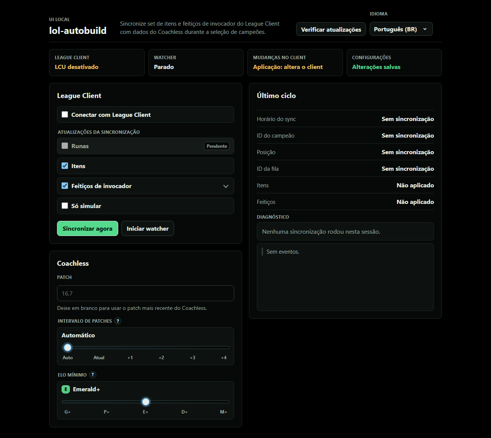

<p align="center">
  <a href="README.md">English</a> | Português
</p>

<div align="center">

# lol-autobuild

Configure runas, itens e spells do League of Legends com dados do Coachless.



</div>

## Download

[Baixar a última release](https://github.com/controlado/lol-autobuild/releases/latest)

Escolha o ZIP do seu sistema, extraia os arquivos e rode `lol-autobuild`.

## O que ele faz

`lol-autobuild` conecta no client durante a seleção de campeões. Ele lê seu campeão e sua rota, consulta dados do Coachless e aplica páginas de runas, itens e spells recomendadas.

## Sobre o Coachless

[Coachless](https://coachless.gg/) é um destaque entre os sites de análise para League of Legends. Ele usa Win Probability Added (WPA) para comparar itens com mais contexto que o win rate puro. Jogadores ganham um jeito mais inteligente de avaliar builds. [xPetu](https://x.com/xPetu) lidera o projeto; jogadores conhecem o trabalho dele pelo Shen em alto nível e pelas análises matemáticas sobre o jogo.

## Primeiro uso

1. Abra o League of Legends.
2. Inicie o `lol-autobuild`.
3. Use a página local que abrir no navegador.
4. Entre no Coachless quando o app pedir.
5. A UI abre em modo de aplicação. Ligue o preview para fazer uma simulação.

O app roda em `127.0.0.1`, no seu próprio computador.

## Comandos básicos

Abrir a UI:

```bash
lol-autobuild
```

Simular uma sincronização pela CLI:

```bash
lol-autobuild sync --dry-run
```

Observar a seleção de campeões em modo de preview pela CLI:

```bash
lol-autobuild watch --dry-run
```

Comandos da CLI usam dry-run por padrão. Passe `--dry-run=false` para aplicar mudanças no client.

Comandos avançados, configuração e limites ficam em [USAGE.md](USAGE.md).

## Aviso

`lol-autobuild` é um projeto open source independente. Ele não tem afiliação com `coachless.gg`; ele apenas lê dados do Coachless e APIs locais do client do League. A Riot Games não endossa nem patrocina este repositório, e ele não tem conexão oficial com League of Legends. `League of Legends` e `Riot Games` são marcas comerciais ou marcas registradas da Riot Games, Inc.
