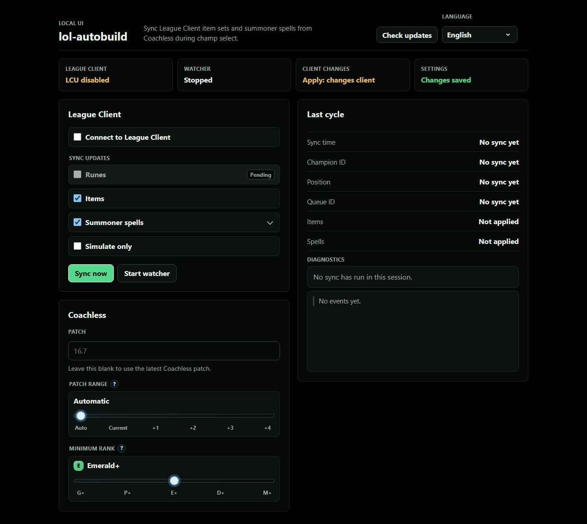

<p align="center">
  English | <a href="README.br.md">Português</a>
</p>

<div align="center">

# lol-autobuild

Set up League of Legends rune pages, item sets, and summoner spells from Coachless data.



</div>

## Download

[Download the latest release](https://github.com/controlado/lol-autobuild/releases/latest)

Pick the ZIP for your system, extract it, and run `lol-autobuild`.

## What it does

`lol-autobuild` connects to the League Client during champion select. It reads your champion and position, checks Coachless data, and applies recommended rune pages, item sets, and summoner spells.

## About Coachless

[Coachless](https://coachless.gg/) is a standout League of Legends analytics site. It uses Win Probability Added (WPA) to compare items with more context than raw win rate. Players get a smarter way to judge builds. [xPetu](https://x.com/xPetu) leads the project; players know him for high-level Shen play and math-based League analysis.

## First run

1. Open League of Legends.
2. Start `lol-autobuild`.
3. Use the local browser page that opens.
4. Log in to Coachless when the app asks.
5. The UI opens in live apply mode. Turn on preview mode for a dry run.

The app runs on `127.0.0.1`, on your own computer.

## Basic commands

Open the local UI:

```bash
lol-autobuild
```

Preview one CLI sync:

```bash
lol-autobuild sync --dry-run
```

Watch champion select in CLI preview mode:

```bash
lol-autobuild watch --dry-run
```

CLI commands use dry-run by default. Pass `--dry-run=false` to apply changes to the League Client.

Advanced commands, config, and limits live in [USAGE.md](USAGE.md).

## Disclaimer

`lol-autobuild` is an independent open source project. It has no affiliation with `coachless.gg`; it only reads Coachless data and local League Client APIs. Riot Games does not endorse or sponsor this repository, and it has no official connection to League of Legends. `League of Legends` and `Riot Games` are trademarks or registered trademarks of Riot Games, Inc.
